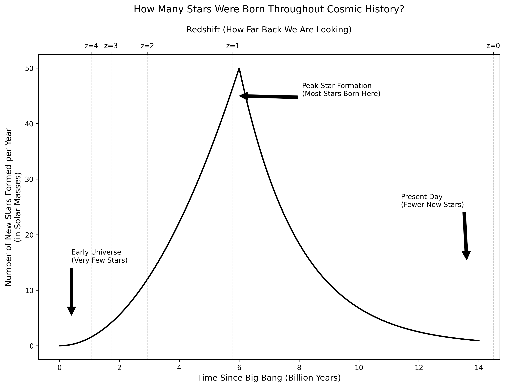

# Temporal Dispersion of the Emergence of Intelligence



This repository contains simulations and visualizations exploring the temporal patterns of intelligent civilization emergence in the universe, with a focus on inter-arrival times between the first intelligent species.

## Repository Structure

The codebase is organized into two main modules:

### 1. Star Formation Rate (`1_star_formation/`)

Simulates the cosmic star formation history across the universe's timeline, from the Big Bang to the present day.

- `star_formation.py`: Models star formation rates throughout cosmic history
- `redshift_explanation.md`: Detailed explanation of redshift concepts and their relation to cosmic time
- `historical_sfr.png`: Visualization of star formation rates over time

### 2. Inter-Arrival Time Simulations (`2_inter_arrival_time/`)

Explores the temporal dispersion of intelligent civilization emergence, focusing on the time gap between the first two civilizations.

- `arrival.py`: Simulates inter-arrival times between first civilizations across multiple universe scenarios
- `avg_iat_plot.py`: Extends the analysis with average inter-arrival time calculations
- `inter_arrival_explanation.md`: Detailed explanation of inter-arrival time concepts
- `inter_arrival_times_comparison.png`: Comparison of IAT distributions for different civilization counts
- `average_iat_vs_nciv.png`: Visualization of how average IAT varies with civilization counts

## Key Concepts

- **Star Formation Rate (SFR)**: The rate at which stars form in the universe, which peaks around 6 billion years after the Big Bang
- **Redshift**: A measure of how much light has been stretched due to the expansion of the universe, used to denote cosmic time
- **Inter-Arrival Time (IAT₁)**: The time difference between the emergence of the first two intelligent civilizations in a universe

## Simulation Parameters

- **Mean emergence time**: 13,000 Million years (Myr)
- **Standard deviation**: 1,500 Million years (Myr)
- **Civilization counts tested**: 10, 100, 1000, 10000 (extended to 50000, 100000 in some simulations)
- **Simulations per scenario**: 1000

## Installation

```bash
# Clone the repository
git clone https://github.com/your-username/temporal-dispersion-intelligence.git

# Navigate to the project directory
cd temporal-dispersion-intelligence

# Create and activate a virtual environment (optional but recommended)
python -m venv venv
source venv/bin/activate  # On Windows: venv\Scripts\activate

# Install required dependencies
pip install -r requirements.txt
```

## Usage

```bash
# Run the star formation simulation
python 1_star_formation/star_formation.py

# Run the basic inter-arrival time simulation
python 2_inter_arrival_time/arrival.py

# Run the extended inter-arrival time analysis
python 2_inter_arrival_time/avg_iat_plot.py
```

## Dependencies

- NumPy
- Matplotlib
- SciPy

## Citation

Temporal Dispersion of the Emergence of Intelligence
Hair, T. W. (2011). Temporal dispersion of the emergence of intelligence: an inter-arrival time analysis. International Journal of Astrobiology, 10(2), 131-135.
Cambridge University Press & Assessment.
https://www.cambridge.org/core/journals/international-journal-of-astrobiology/article/temporal-dispersion-of-the-emergence-of-intelligence-an-interarrival-time-analysis/
